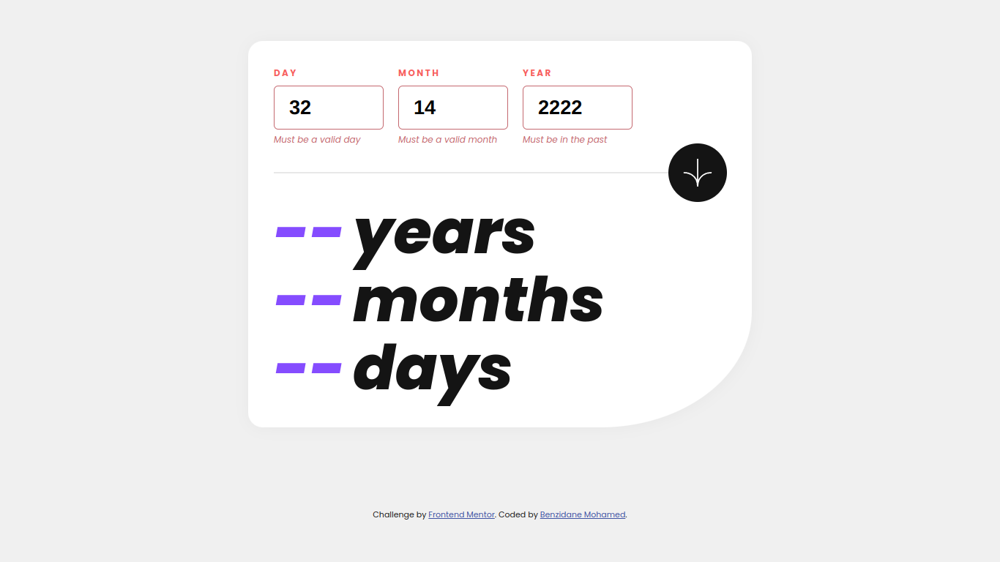

# Frontend Mentor - Testimonials grid section solution

This is a solution to the [Age calculator app challenge on Frontend Mentor](https://www.frontendmentor.io/challenges/age-calculator-app-dF9DFFpj-Q). Frontend Mentor challenges help you improve your coding skills by building realistic projects. 

## Table of contents

- [Overview](#overview)
  - [Screenshot](#screenshot)
  - [Links](#links)
- [My process](#my-process)
  - [Built with](#built-with)
  - [What I learned](#what-i-learned)
- [Author](#author)


## Overview

### Screenshot


### Links

- Solution URL: [solution URL here](https://github.com/BenzidaneMo/-Age-calculator-app-new)
- Live Site URL: [here](https://benzidanemo.github.io/-Age-calculator-app-new/)

## My process

### Built with

- Semantic HTML5 markup
- CSS Grid
- Flexbox
- [Vite](https://vitejs.dev/)
- [Luxon](https://moment.github.io/luxon/#/)

### What I learned

During my recent project, I had the opportunity to work with [Vite](https://vitejs.dev/) for the first time, a powerful build tool for web applications. It provided a seamless development experience with its fast and efficient development server.
Additionally, I leveraged the [Luxon](https://moment.github.io/luxon/#/) DateTime object to manipulate time-related data, such as year, month, and day, which proved to be a reliable and user-friendly solution.
```install luxon
npm i luxon
```
However, one of the challenges I faced was displaying error text effectively. Despite this obstacle, I managed to overcome it and ensure that error messages were displayed appropriately.

To facilitate further understanding, I took the initiative to add comments throughout my code, enabling anyone interested to delve into my solution in detail and gain insights into my implementation.

## Author

- Frontend Mentor - [@BenzidaneMo](https://www.frontendmentor.io/profile/BenzidaneMo)
- Twitter - [@Miracleinvoker_](https://twitter.com/Miracleinvoker_)